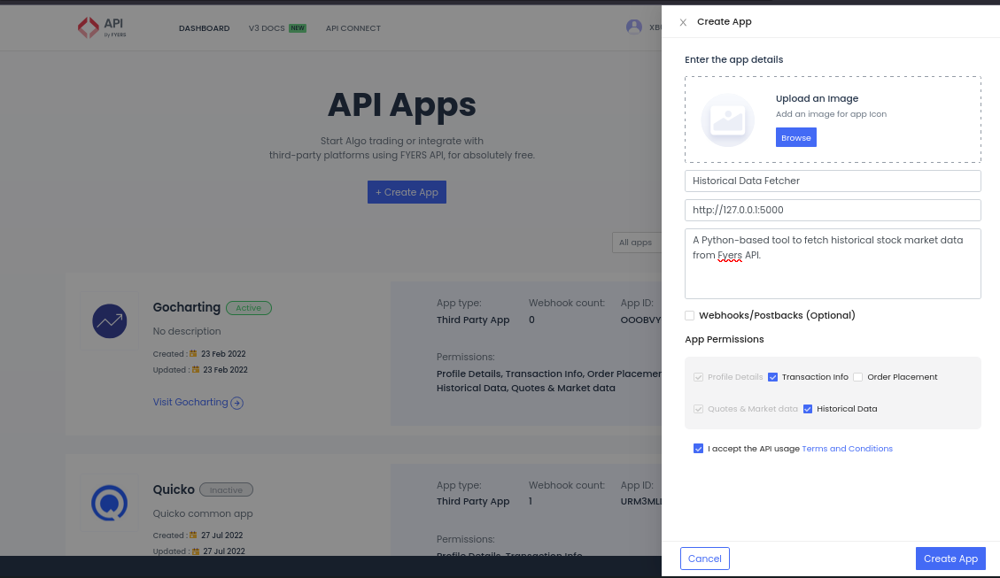

# Historical Market Data Fetcher using Fyers API

## Overview
This script fetches historical market data from the Fyers API using user-provided API credentials, access tokens, and data parameters. The data is retrieved in OHLC format and saved as a CSV file for further analysis.

## Features
- Reads API credentials from a JSON file
- Authenticates with the Fyers API and generates an access token
- Fetches historical data based on user-specified parameters
- Handles API limits by breaking requests into manageable date ranges
- Saves fetched data as a CSV file

## Prerequisites
To get started, you must have an account with Fyers. Once you have an account, you need to create an app to obtain API credentials.
 - Log in to Fyers API Portal <https://myapi.fyers.in/>.
 - Go to the Dashboard section and click on Create App.
- Fill in the required app details as shown in the screenshot below:


Ensure that the redirect URI is set to http://127.0.0.1:5000 (the Python script sets up a temporary local server to capture the authentication code).

Once the app is created, you will receive an App ID and Secret ID, which are necessary for the Python script to connect to the Fyers API.

## Installation

1. Clone the repository or download the script.
2. Navigate to the cloned respository using:
   ```sh
   cd fyers-data-fetcher
   ```
3. Create a virtual environment and activate it using:
   ```sh
   python3 -m venv .fyers_venv
   source .fyers_venv/bin/activate
   ```
5. Now install the required dependencies in the created **fyers_venv** using pip:
    ```sh
    pip install numpy pandas fyers-apiv3
    ```

## Configuration
### `api_cred.json`
This file should store your Fyers API credentials in the following format:
```json
{
    "ClientID": "your_app_id",
    "SecretID": "your_secret_id",
    "RedirectURI": "your_redirect_uri",
    "ResponseType": "code",
    "State":"fyers",
    "GrantType": "authorization_code"
}
```

### `data_parameters.json`
Specify the market data request parameters:
```json
{
    "ScriptName": "NSE:RELIANCE-EQ",
    "Resolution": "D",
    "StartDate": "01-01-2023",
    "EndDate": "31-12-2023"
}
```

## Usage

1. Run the script:
    ```sh
    python ./fyers_data_fetcher.py
    ```
2. If you have a valid access token for the day which is saved in the file **access_token.txt** , enter 'y' when prompted.
3. Or else ff you do not have an access token or if the access token is expired because you are running the script on an another day, then type 'n' when promted for access token availability. Follow the on-screen instructions and copy the created authentication link and open it in a browser. You will be asked to login to Fyers to authenticate yourself.
4. Once you authenticate, you will be redirected to a local server page. You just need to close this. The script automatically copy the generated auth code and then generates an access token which is valid for the day and save it to the file **accees_token.txt**.
4. Then the script will fetch the requested historical data and save it as a CSV file in the `downloaded_data` folder.

## Output
The script will generate a CSV file in the format:
```
{Symbol}_{Resolution}_{StartDate}_to_{EndDate}.csv
```
For example:
```
RELIANCE_EQ_D_01-01-2023_to_31-12-2023.csv
```

## Logging
The script logs important steps and errors in the console for easy debugging. The Fyers API also creates log files.

## License
This project is licensed under the MIT License.

## Author
Developed by Brian Pinto
